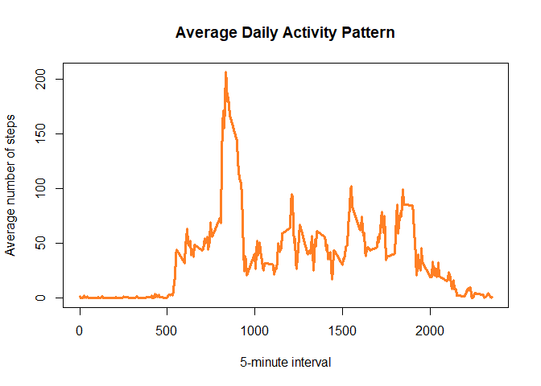

## Loading and preprocessing the data

```r
if (!file.exists('activity.csv')) {
  unzip(zipfile = "activity.zip")
}
activityData <- read.csv(file="activity.csv", header=TRUE)
library(ggplot2)
```


## What is mean total number of steps taken per day?

```r
total_steps <- aggregate(steps~date,activityData,sum)
hist(total_steps$steps,main = "Total Steps per Day",xlab = "Number of Steps")
```

<!-- -->

```r
mean_steps <- mean(total_steps$steps, na.rm = TRUE)
median_steps <- median(total_steps$steps, na.rm = TRUE)
cat("Mean Number of Steps Taken per Day = ", mean_steps,"\n")
```

```
## Mean Number of Steps Taken per Day =  10766.19
```

```r
cat("Median Number of Steps Taken per Day = ", median_steps)
```

```
## Median Number of Steps Taken per Day =  10765
```


## What is the average daily activity pattern?

```r
avg_steps <- aggregate(steps~interval,activityData,mean,na.rm = TRUE)
plot(avg_steps$interval, avg_steps$steps, type = "l",col="chocolate1",lwd=3,
     main="Average Daily Activity Pattern",
     xlab = "5-minute interval", 
     ylab = "Average number of steps")
```

<!-- -->

```r
max_avg <- avg_steps$interval[which.max(avg_steps$steps)]
cat(sprintf("The %s-th 5-minute interval contains the maximum number of steps",max_avg))
```

```
## The 835-th 5-minute interval contains the maximum number of steps
```


## Imputing missing values

```r
total_na<-sum(is.na(activityData$steps))
cat(sprintf("There are %s missing values in the dataset.\n",total_na))
```

```
## There are 2304 missing values in the dataset.
```

```r
new_activity<-activityData
for (i in avg_steps$interval){
  new_activity[new_activity$interval==i & is.na(new_activity$steps),]$steps<-avg_steps$steps[avg_steps$interval==i]
}
#head(new_activity)
steps_daily <- aggregate(steps~date,new_activity,sum)
hist(steps_daily$steps, main = "Imputed Number of Steps Per Day", xlab = "Number of Steps")
```

<!-- -->

```r
mean_steps2 <- mean(steps_daily$steps)
median_steps2 <- median(steps_daily$steps)
cat("Mean Number of Steps Taken per Day =", mean_steps2,"\n")
```

```
## Mean Number of Steps Taken per Day = 10766.19
```

```r
cat("Median Number of Steps Taken per Day =", median_steps2,"\n")
```

```
## Median Number of Steps Taken per Day = 10766.19
```

```r
diff_mean <- mean_steps - mean_steps2
diff_median <-median_steps - median_steps2
cat(sprintf("The mean difference is %s and the median difference is %s.", diff_mean,round(diff_median,3)))
```

```
## The mean difference is 0 and the median difference is -1.189.
```


## Are there differences in activity patterns between weekdays and weekends?

```r
new_activity$weekday  <- weekdays(as.Date(new_activity$date))
new_activity$weekday_type <- ifelse(new_activity$weekday == "Saturday" | new_activity$weekday == "Sunday", "Weekend", "Weekday")

avg_steps2 <- aggregate(steps~interval+weekday_type,new_activity,mean,na.rm = TRUE)
ggplot(avg_steps2,aes(interval, steps))+
  geom_line(aes(col=weekday_type),size=0.7)+
  facet_wrap(~weekday_type,nrow=2)+
  scale_color_manual(values = c("#CF4520","#002D72"), guide="none")+
  labs(x = "Intervals", y = "Average steps taken") +
  ggtitle("Time series of Average steps taken Weekday vs Weekend")
```

<!-- -->

